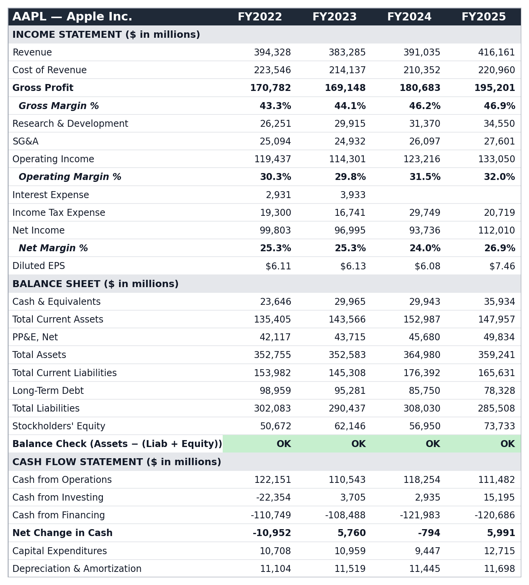

# Automated Financial Statement Spreading Tool

A portfolio project that automates the "spreading" work junior IB/equity
research analysts do by hand: pulling numbers out of 10-K filings and laying
them into a standardized 3-statement model (Income Statement, Balance Sheet,
Cash Flow).

Demoed on 10 large-cap tech filers: AAPL, MSFT, GOOGL, AMZN, META, NVDA,
ORCL, ADBE, CRM, INTC — 4 fiscal years each, output as one Excel workbook
with a company tab per ticker and a cross-referenced comps summary.



*Margins, Gross Profit, and Net Change in Cash are live Excel formulas
referencing the raw filing data, not hardcoded numbers. The balance-sheet
tie-out row is conditionally formatted green/red based on whether Assets
actually equals Liabilities + Equity for that year.*

## Why XBRL, not PDF parsing

The obvious approach — regex/PDF-table-extraction over the filing text — is
what real data vendors (Capital IQ, FactSet) have spent years of engineering
on, because filing layouts vary company to company and year to year and
break parsers constantly.

Since 2009, every 10-K has also been filed with **XBRL tags**: every line
item is machine-readable with a standardized concept name
(`us-gaap:Revenues`, `us-gaap:Assets`, etc.), retrievable as JSON from SEC
EDGAR with no auth. This tool is built entirely on that structured data —
it does not parse filing text or PDFs at all.

The real difficulty isn't extraction, it's **reconciliation**: companies tag
the same economic concept differently. Apple has no `CostOfRevenue` tag,
only `CostOfGoodsAndServicesSold`; Microsoft has both `Revenues` and
`RevenueFromContractWithCustomerExcludingAssessedTax`. `src/tag_mapping.py`
curates, for ~22 standardized line items, an ordered list of candidate XBRL
tags per item; the spreader tries each in priority order and takes the first
one a given filer actually reports. That mapping — not the HTTP calls — is
the actual "spreading" skill this project demonstrates.

A second, subtler gotcha this tool works around (see the docstring in
`src/spreader.py`): the `fy`/`fp` fields SEC attaches to each XBRL datapoint
describe the *filing's* fiscal year, not the period the datapoint covers —
every 10-K re-reports 2-3 years of comparatives under the same filing-level
`fy`. Naively grouping by that field silently mixes years together. This
tool derives the fiscal year from each datapoint's own `end` date instead,
and de-duplicates restated values by keeping the most recently filed one.

## What it produces

One `.xlsx` with:
- **One tab per company** — Income Statement, Balance Sheet, and Cash Flow
  stacked with fiscal years as columns. Subtotals (Gross Profit, margins,
  Net Change in Cash) are **Excel formulas** referencing the input cells,
  not hardcoded numbers, so the sheet behaves like a real model, not a data
  dump. A balance-sheet tie-out row (`=IF(ABS(Assets-(Liab+Equity))<1,...)`)
  is conditionally formatted green/red.
- **A Comps Summary tab** — revenue, growth, margins, ROE per company, pulled
  via cross-sheet formulas pointing at each company's own tab.

Where a filer doesn't report Total Liabilities directly (Amazon, Oracle,
Intel all omit that specific tag), it's derived as Total Assets − Equity and
shown in italics with a footnote — it isn't silently treated as identical to
a reported figure.

## Setup

```bash
python3 -m venv .venv
source .venv/bin/activate
pip install -r requirements.txt
```

## Usage

```bash
python main.py
python main.py --tickers AAPL,MSFT,GOOGL --years 4 --out output/spread.xlsx
```

Raw SEC responses are cached in `cache/` so repeated runs don't re-hit the
API. Output defaults to `output/spread.xlsx`.

## Tests

```bash
pytest tests/
```

Unit tests cover the tag-fallback resolution, the fiscal-year-from-`end`-date
derivation (including the filing-year mislabeling case above), and the
balance-sheet tie-out / completeness checks — all offline, no network calls.

## Scope & what a production version would add

This is intentionally scoped for a portfolio demo, not a production tool:

- **Annual (10-K) data only** — no quarterly (10-Q) figures.
- **~22 standardized line items** — enough to populate a clean 3-statement
  model, not every possible disclosure line.
- **No PDF/OCR fallback** — filers without XBRL data (pre-2009, or non-US
  filers under different taxonomies) aren't supported.
- **Tag mapping curated for large-cap US filers** — extending to small-caps
  or other sectors (e.g. banks, which don't report a traditional COGS line)
  would need additional tag research and possibly sector-specific templates.
